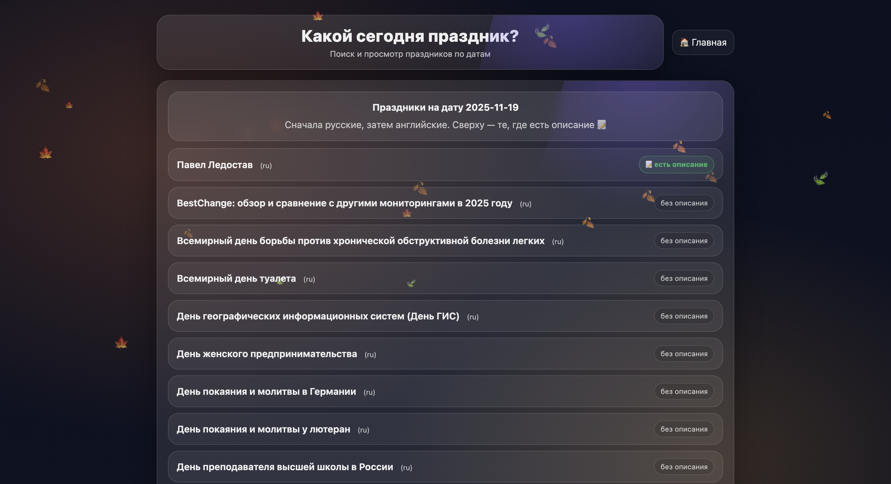
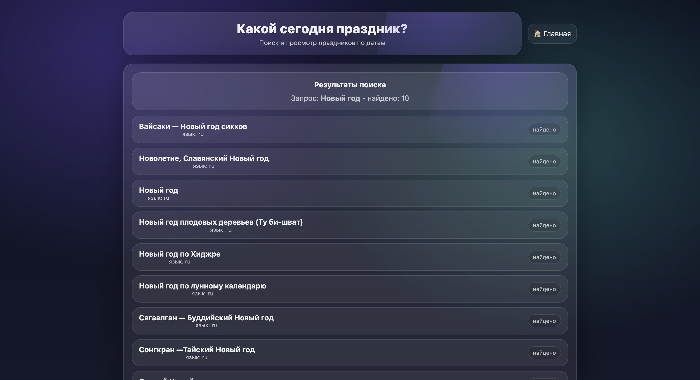
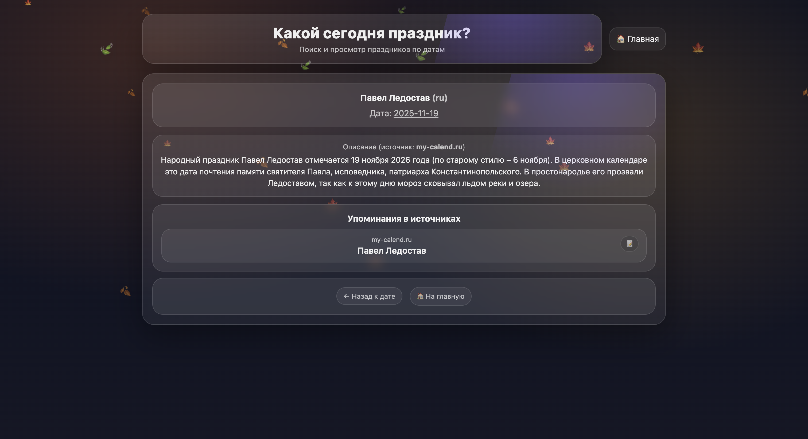

Поиск праздников
Веб-приложение для поиска и просмотра праздников по датам и названиям.

Проект собирает данные из нескольких источников (calend.ru, wikipedia, my-calend.ru), объединяет их в одну базу и показывает:

какие праздники есть в выбранную дату

поиск праздников по названию

показывает описание праздников, если оно есть

автоматически меняет оформление по сезону (зима / весна / лето / осень)

Возможности:

Просмотр праздников по дате

Поиск по названию

Страница каждого праздника:

дата

описание (если найдено)

источники

УСТАНОВКА И ЗАПУСК

1. Клонировать проект

git clone <repo_url>
cd holiday_project

2. Создать виртуальное окружение

python3 -m venv venv
source venv/bin/activate

3. Установить зависимости

pip install fastapi uvicorn requests beautifulsoup4 lxml rapidfuzz

Запуск сайта
python3 -m uvicorn webapp.main:app --reload

Открыть в браузере:
http://127.0.0.1:8000

ПРИМЕРЫ ИНТЕРФЕЙСА








## 🐳 Запуск через Docker

1. Установить Docker Desktop: https://www.docker.com/products/docker-desktop/
2. Запустить Docker Desktop
3. В корне проекта выполнить:

```bash
docker compose up --build